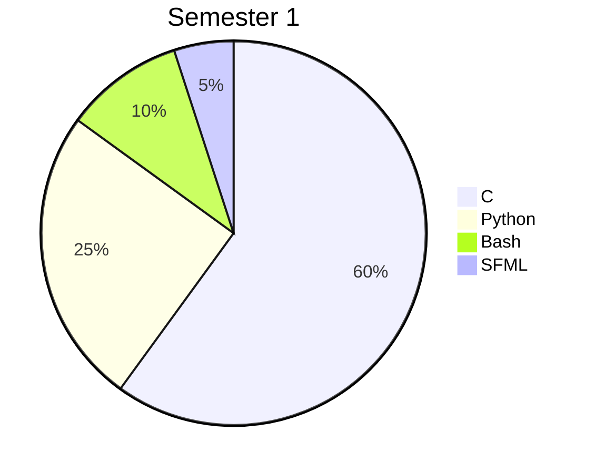

# **🎓 EPITECH Tek1 Journey**  
### *First Year of Software Engineering & Business*  

  

---

## **📂 Repository Tree** *(with tech tags!)*  
```bash
.
├── Semester1/            # "Baby Coder" Phase 👶💻
│   ├── B-MAT-100/        # Math + Python 🐍
│   │   ├── 101pong       [Python, numpy]
│   │   ├── 102architect  [Python, linear algebra]
│   │   ├── 103cipher     [Python, ASCII encryption]
│   │   ├── 104intersection [Python, 3D geometry]
│   │   └── 105tours      [Python, recursion]
│   ├── B-MUL-100/        # Game Dev 🎮
│   │   ├── my_hunter     [C, SFML]
│   │   └── my_runner     [C, SFML, parallax]
│   └── B-PSU-101/        # Shell Magic 🐚
│       └── minishell1    [C, fork, execvp]
│
└── Semester2/            # "I Speak Machine" Phase 🤖💬
    ├── B-AIA-200/        # AI Car 🚗💨
    │   └── need4stek     [C, PID control]
    ├── B-CPE-200/        # Algorithms 🧠
    │   └── lem-in        [C, BFS/DFS, graph theory]
    ├── B-DOP-200/        # DevOps 🔄
    │   ├── chocolatine   [Bash, packaging]
    │   └── popeye        [C, containerization]
    ├── B-MAT-200/        # Math Wizardry 🔢
    │   ├── 106bombyx     [Python, ODEs]
    │   ├── 107transfer   [Python, FFT]
    │   ├── 108trigo      [Python, matplotlib]
    │   ├── 109titration  [Python, chemistry]
    │   └── 110borwein    [Python, integrals]
    ├── B-MUL-200/        # Game Dev Pro 🕹️
    │   ├── MyDefender    [C, SFML, TD mechanics]
    │   └── MyRPG         [C, SFML, RPG systems]
    ├── B-PSU-200/        # Shell Pro 🖥️
    │   └── my_sokoban    [C, ncurses]
    └── B-PSU-210/        # Shell God Mode ⚡
        └── 42sh          [C, lex/yacc, job control]
```

---

## **📊 Semester 1: "Hello, World!" to "I Made a Shell?!"**  

### **B-MAT-100 (Python Math)**  
| Project | Tech Stack | What I Learned |
|---------|------------|----------------|
| **101pong** | `Python` `numpy` | Vector math, CLI args |
| **102architect** | `Python` `linear algebra` | 2D transformations (translate/rotate/scale) |
| **103cipher** | `Python` `ASCII manipulation` | Encryption/decryption logic |
| **104intersection** | `Python` `3D geometry` | Ray-sphere collision math |
| **105tours** | `Python` `recursion` | Tower of Hanoi solver |

### **B-MUL-100 (Game Dev)**  
| Project | Tech Stack | What I Learned |
|---------|------------|----------------|
| **my_hunter** | `C` `SFML` `sprites` | Game loop, event handling |
| **my_runner** | `C` `SFML` `parallax` | Infinite scrolling, collisions |

### **B-PSU-101 (Systems)**  
| Project | Tech Stack | What I Learned |
|---------|------------|----------------|
| **minishell1** | `C` `fork` `execvp` `pipes` | Basic shell commands |

---

## **🚀 Semester 2: "I Can’t Believe This Works"**  

### **B-AIA-200 / B-CPE-200 (AI & Algorithms)**  
| Project | Tech Stack | What I Learned |
|---------|------------|----------------|
| **need4stek** | `C` `PID control` | Autonomous car sensor logic |
| **lem-in** | `C` `BFS/DFS` `graph theory` | Pathfinding for ant colonies |

### **B-DOP-200 (DevOps)**  
| Project | Tech Stack | What I Learned |
|---------|------------|----------------|
| **chocolatine** | `Bash` `packaging` | Simple package manager |
| **popeye** | `C` `containers` | Process isolation tricks |

### **B-MAT-200 (Advanced Math)**  
| Project | Tech Stack | What I Learned |
|---------|------------|----------------|
| **106bombyx** | `Python` `ODEs` | Moth population modeling |
| **107transfer** | `Python` `FFT` | Fourier transforms |
| **108trigo** | `Python` `matplotlib` | Trigonometry visualizer |
| **109titration** | `Python` `chemistry` | pH curve analysis |
| **110borwein** | `Python` `integrals` | Numerical approximation |

### **B-MUL-200 (Game Dev Pro)**  
| Project | Tech Stack | What I Learned |
|---------|------------|----------------|
| **MyDefender** | `C` `SFML` `tower defense` | Enemy waves, economy systems |
| **MyRPG** | `C` `SFML` `RPG mechanics` | Inventory, quests, open world |

### **B-PSU-200 / B-PSU-210 (Shell Pro)**  
| Project | Tech Stack | What I Learned |
|---------|------------|----------------|
| **my_sokoban** | `C` `ncurses` | Grid-based puzzle logic |
| **42sh** | `C` `lex/yacc` `job control` | Full shell with pipes, redirections |

---

## **🎯 Tech Stack Summary**  


### **🔥 Most Intense Projects**  
1. **42sh** (Shell with lex/yacc) — *"I now fear terminals less."*  
2. **MyRPG** (Open-world RPG) — *"1000 lines of inventory code later..."*  
3. **lem-in** (Pathfinding) — *"Graphs are love, graphs are life."*  

---

## **💬 One-Liner Wisdom**  
> *“Semester 1: ‘How do pointers work?’  
> Semester 2: ‘How do I make an AI car **not** crash?’”*  

Here’s a **cute, colorful, and professional** `README.md` summarizing your first year at Epitech (Tek1) with all your projects!  

---


---

## **📁 Repository Structure**  
```bash
.
├── Semester1/            # Basics of C & Python Math
│   ├── B-MAT-100/        # Math Projects (Python)
│   │   ├── 101pong       # Ball trajectory calculator
│   │   ├── 102architect  # 2D transformations
│   │   ├── 103cipher     # Encryption/decryption tool
│   │   ├── 104intersection # Ray-sphere intersection
│   │   └── 105tours      # Tower of Hanoi solver
│   ├── B-MUL-100/        # Game Dev (SFML)
│   │   ├── my_hunter     # Duck Hunt clone
│   │   └── my_runner     # Infinite runner game
│   └── B-PSU-101/        # Shell Programming
│       └── minishell1    # Basic Unix shell
│
└── Semester2/            # Advanced C & More Math
    ├── B-AIA-200/        # AI for autonomous car
    │   └── need4stek     # Self-driving algorithm
    ├── B-CPE-200/        # Algorithmics
    │   └── lem-in        # Pathfinding for ants
    ├── B-DOP-200/        # DevOps & Scripting
    │   ├── chocolatine   # Package manager
    │   └── popeye        # Containerization tool
    ├── B-MAT-200/        # Advanced Math (Python)
    │   ├── 106bombyx     # Moth population modeling
    │   ├── 107transfer   # Fourier transforms
    │   ├── 108trigo      # Trigonometry visualizer
    │   ├── 109titration  # pH curve analysis
    │   └── 110borwein    # Integral approximation
    ├── B-MUL-200/        # Advanced Game Dev (SFML)
    │   ├── MyDefender    # Tower Defense game
    │   └── MyRPG         # Open-world RPG
    ├── B-PSU-200/        # Advanced Shell
    │   └── my_sokoban    # Sokoban puzzle game
    └── B-PSU-210/        # Ultimate Shell Challenge
        └── 42sh          # Full-featured shell
```

---

## **🌟 Semester 1: Foundations**  
### **💻 C Programming & Python Math**  
| Project | Description | Skills Gained |
|---------|------------|--------------|
| **101pong** | Calculates ball trajectory | Python, vectors |
| **102architect** | 2D transformations (translation, rotation) | Matrices, CLI parsing |
| **103cipher** | Encrypts/decrypts messages | ASCII manipulation |
| **104intersection** | Ray-sphere intersection solver | Geometry, algorithms |
| **105tours** | Solves Tower of Hanoi | Recursion, optimization |
| **my_hunter** | Duck Hunt clone (SFML) | Game loops, event handling |
| **my_runner** | Infinite runner game (SFML) | Sprites, collisions |
| **minishell1** | Basic Unix shell | Process management, syscalls |

### **📈 Key Learnings**  
✅ **C Basics** (memory, pointers, Makefile)  
✅ **Python Math** (vectors, matrices, algorithms)  
✅ **Game Dev** (SFML, sprites, animations)  
✅ **Shell Programming** (fork, exec, pipes)  

---

## **🚀 Semester 2: Advanced Topics**  
### **🤖 AI, Algorithms & DevOps**  
| Project | Description | Skills Gained |
|---------|------------|--------------|
| **need4stek** | Autonomous car AI | Sensor data, PID control |
| **lem-in** | Ant colony pathfinder | Graph theory, BFS/DFS |
| **chocolatine** | Package manager | Scripting, dependency handling |
| **popeye** | Containerization tool | Process isolation |
| **106bombyx** | Moth population model | Differential equations |
| **107transfer** | Fourier transforms | Signal processing |
| **108trigo** | Trigonometry visualizer | Matplotlib, numpy |
| **109titration** | pH curve analyzer | Chemistry + Python |
| **110borwein** | Integral approximation | Numerical methods |
| **MyDefender** | Tower Defense game | SFML, enemy AI |
| **MyRPG** | Open-world RPG | Game design, state machines |
| **my_sokoban** | Sokoban puzzle | Grid-based logic |
| **42sh** | Full Unix shell | Lexing, parsing, job control |

### **📊 Key Learnings**  
✅ **Advanced C** (multithreading, IPC)  
✅ **AI & Algorithms** (pathfinding, PID control)  
✅ **DevOps** (containers, scripting)  
✅ **Advanced Math** (Fourier, integrals, ODEs)  
✅ **Complex Game Dev** (RPG mechanics, AI)  

---

## **🎯 Skills Acquired in Tek1**  
| **Category** | **Technologies** |
|-------------|-----------------|
| **Languages** | C, Python, Bash |
| **Game Dev** | SFML, Sprites, Collisions |
| **Math** | Linear Algebra, Calculus, ODEs |
| **Systems** | Shells, Syscalls, IPC |
| **AI/Algo** | Pathfinding, PID Control |
| **Tools** | Git, Makefile, Valgrind |

---

## **🎨 Fun Facts**  
- **Favorite Project**: `MyRPG` (built an entire open-world game!)  
- **Hardest Challenge**: `42sh` (full shell with job control)  
- **Most Useful Skill**: **Debugging with Valgrind** 🧙♂️  

---

## **📜 Quote to End On**  
> *"First year at Epitech is like drinking from a firehose—but you learn to love the pressure!"*  

🚀 **Keep coding, stay curious!**  
